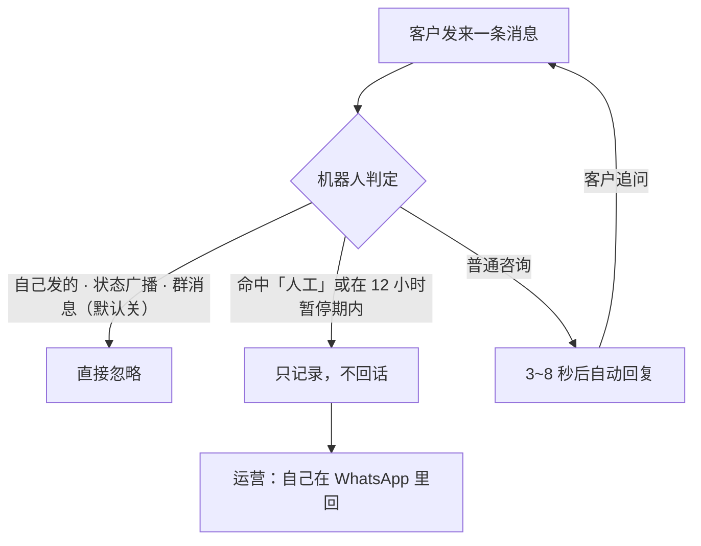

# WhatsApp AI 客服（个人号版）

用你自己的一张 WhatsApp 号做 AI 客服：扫码/配对码登录，客户来消息自动回复，答不上来转人工。
**不依赖任何第三方机器人平台，不装 Docker 也能跑。**

```
客户 WhatsApp  ⇄  Baileys 协议  ⇄  node bot-baileys.mjs  ⇄  任意 OpenAI 兼容 LLM
                                        └─ lib.mjs：过滤 · 去重 · 上下文 · 转人工 · 拟人延迟
```

- 语言/运行时：Node ≥ 22.13（22.5–22.12 的 `node:sqlite` 还要加实验开关；推荐 Node 24，零框架）
- 依赖：`baileys` + `qrcode-terminal`（共 2 个）
- 数据：全部落在本机 `data/`（SQLite + 登录态）
- **不写代码的运营同事**：直接看下面「给运营：日常怎么用」那一节，前面的部署内容交给技术

---

## 特性

| 能力 | 说明 |
|---|---|
| 幂等去重 | 按消息 id 落库，传输层重试不会重复回复 |
| 多轮上下文 | 每个客户独立会话，最近 12 条消息存 SQLite，重启不丢 |
| 并发安全 | 同一客户的消息排队串行，连发两条不会丢上下文、不会乱序 |
| 自动清理 | 去重表留 30 天、会话历史留 180 天，SQLite 不会无限长 |
| 转人工 | 客户命中关键词（默认 `人工` / `转人工` / `human agent` / `real person`），或模型答不上来 / 调用失败，或客户发来语音、无说明的图片 / 视频 / 文件，该会话暂停 N 小时，只记录不回复 |
| 拟人节奏 | 先出「正在输入」，按回复字数等待后再发送，封顶 6 秒 |
| 不乱回 | 群聊（可开）、状态广播一律忽略；机器人自己发的消息不会被当成运营接管 |
| 模型可换 | OpenAI / DeepSeek / 本地 Ollama / 自建 MaxKB，只改 3 个环境变量 |
| 两种传输 | Baileys 直连（无需 Docker）或 WAHA HTTP（有 Docker 时） |
| 终端模拟器 | `npm run sim` 不用手机就能验模型与话术 |
| 容器化 | 有 Docker 的机器可以一键起 WAHA + bot |

---

## 给运营：日常怎么用（非技术，照表做就行）

### 一、一句话看懂它替谁干活

客户的 WhatsApp 私聊里，机器人替你先回；**答不了、或客户点名要人，它把人交给你**。运营不需要装任何软件：只改一个 `.env` 文件里的话术，加一张 WhatsApp 号接手转人工的客户。



### 二、客户实际会看到什么

| 时刻 | 客户看到 | 后台在做 |
|---|---|---|
| 0 秒 | 消息发出 | 收信、按消息 id 去重（重复推送只回一次） |
| 约 1 秒 | 「正在输入…」 | 拼上该客户最近 12 轮上下文，调大模型 |
| 3~8 秒 | 一段完整答复 | 按回复字数等一会儿再发（封顶 6 秒），收发都落库 |

**为什么故意慢**：秒回像机器人，也更容易被判风控。这个节奏是设计出来的，不要催技术改快。

### 三、谁做什么（选一次，之后不用管）

| 情况 | 走哪条 | 谁来做 |
|---|---|---|
| 电脑装不了 Docker / 老 Windows | 路线 A：Baileys 直连 | 技术按「快速开始 → 路线 A」装一次（约 20 分钟） |
| 有能常开的 Docker 机器 | 路线 B：WAHA 容器 | 技术按「快速开始 → 路线 B」起一次 |

运营要准备的只有两样：**一台能一直开着的机器** + **一张副号**（见第八节红线）。

### 四、日常节奏

| 频率 | 做什么 | 怎么算合格 | 不合格怎么办 |
|---|---|---|---|
| 每天 | 把「转人工」的客户挨个自己回 | 收到「已为您转接人工」的那几个会话 | 直接在 WhatsApp 里回，**这 12 小时内机器人不会替你回**；你每回一句，12 小时重新计满 |
| 每天 | 确认机器人还活着 | 用另一个号发一句，3~8 秒内有回复 | 找技术重启（见「故障排查」） |
| 每周 | 抽查 10 条自动回复 | 有没有编价格 / 交期 / 认证 | 改 `.env` 的 `SYSTEM_PROMPT`（第六节） |
| 每月 | 看 LLM 账单 + 备份 `data\` 目录 | 费用在预算内；`data\` 能复制出来 | 超预算 → 换便宜模型或本地 Ollama |
| 上线首 48 小时 | 副号小范围跑，人盯着 | 无掉线、无异常提示 | 有异常立即停用该号 |

### 五、转人工：运营必须知道的 4 条

1. **触发**：客户消息里出现默认关键词（`人工` / `转人工` / `human agent` / `real person`，任意位置命中即可），或模型答不上来（能答的部分先发出去）、模型调用报错或超时、客户发来语音或无说明的图片 / 视频 / 文件（历史里记成 `[语音]` 这类占位；贴纸和表情回应不算）→ 机器人回一句转接话术，该客户**暂停 12 小时**。
2. **暂停期间机器人只记录、不回话**（消息照旧存进历史）。这 12 小时里客户靠**你**回。转接话术**没发出去就不会静默**（避免客户既没收到话术、又被晾 12 小时）。暂停期间客户又说了关键词，12 小时从那一刻**重新计满**，但不会再发一遍转接话术。
3. **运营直接回复即接管**：你在手机（或其他已关联设备）上亲自给客户发任何消息，文字、图片、语音都算，该会话立刻转人工、12 小时内机器人不再插话；你每发一句都重新计满。不需要任何指令。你说过的话会记进会话历史，12 小时后机器人接着聊时看得到。
4. **想改时长**：`.env` 里的 `PAUSE_HOURS`。想让某个客户**立刻**恢复自动回复，需要技术删 `data/bot.db` 里 `pause` 表对应那一行。

> 关键词表是 `.env` 的 `PAUSE_KEYWORD`（子串匹配、不分大小写），默认 `人工,转人工,human agent,real person`。**只加词组，别加裸词**：单独一个 `human` 会把「human hair」（真人发丝）这类正常咨询也判成要人工，那客户会被静默 12 小时。

### 六、改话术（运营唯一要动的文件）

所有对外口径都来自 `.env` 里的 `SYSTEM_PROMPT`。**产品事实不写进去，它要么转人工，要么编。**

**「禁忌」那一行必须保留 `[[HANDOFF]]`**：模型答不上来时在回复末尾输出这个标记，机器人才会把会话转给你（标记不会发给客户）。删了它，模型答不上来时只会自己说一句“转人工”，会话并不会真的转给你。

```ini
SYSTEM_PROMPT=你是 XX 品牌的海外客服，回复简洁专业，先答问题再问需求。
事实：发货覆盖欧盟/美国/东南亚；欧盟 7-12 天，美国 10-15 天；支持电汇/PayPal；
      质保 12 个月，非人为损坏包换；MOQ 50 件，样品可单卖。
口径：不报最低价，价格一律引导到邮件报价；不承诺具体到达日期；不评价竞品。
禁忌：不确定的不要编：能答的部分照常回答，答不上来的在回复末尾附上 [[HANDOFF]]，不要自己说转人工。
```

改完让它生效：关掉程序窗口 → 重新 `npm run start:baileys`（Docker 版则重启容器）。

### 七、出问题先看这张表

| 现象 | 运营先做 | 之后 |
|---|---|---|
| 客户说「机器人没回我」 | 看这客户是不是说过「人工」（在暂停期） | 是 → 你自己回；不是 → 找技术 |
| 客户收到重复答复 | 记下客户号 + 时间 | 找技术（多为消息重推 / 并发） |
| 答得不准、编事实 | 截图存证 | 改 `SYSTEM_PROMPT`，把事实补进去 |
| 客户要人工但机器人还在回 | 先人工回复客户 | 把客户的用词加进 `PAUSE_KEYWORD` |
| 突然全部不回 | 用测试号发一句确认 | 找技术重启，并把窗口里的报错截图给他 |
| 手机弹「已从其他设备登出」 | **立即停用该号** | 找技术重新扫码；排查是否群发过 |

### 八、红线（会封号，不可申诉）

- 用**副号**跑，不要用主号。
- **不要群发、不要主动冷启动陌生人**——这套是「客户先来、机器人回」，不是营销群发工具。
- 非官方协议，违反 WhatsApp 服务条款，**封号不可申诉**。
- 客户消息原文会发给你配置的模型厂商；数据不能外发就换本地 Ollama。

---

## 快速开始

### 路线 A：不装 Docker（推荐，Windows 老版本也可）

```bash
# 1. 装 Node 24（nodejs.org）
node -v                          # 需要 ≥ v22.13（推荐 24）

# 2. 装依赖
npm install

# 3. 配置
cp .env.example .env             # 填 OPENAI_API_KEY、WHATSAPP_PHONE
#    Windows: Copy-Item .env.example .env   （用记事本保存为 UTF-8）

# 4. 先在终端验模型和话术，不碰手机
npm run sim

# 5. 登录（终端出 8 位配对码）
npm run login
#    手机：WhatsApp → 设置 → 已关联的设备 → 关联设备 → 改用配对码登录

# 6. 常驻运行
npm run start:baileys
```

开机自启（Windows）：

```powershell
schtasks /create /tn WhatsAppBot /tr "cmd /c cd /d C:\whatsapp-ai-cs && node --env-file-if-exists=.env bot-baileys.mjs" /sc onlogon /f
```

> 老控制台渲染二维码容易糊，**优先用配对码**（`.env` 里填 `WHATSAPP_PHONE`，国家码开头不带 +）。

### 路线 B：有 Docker（WAHA 网关）

```bash
cp .env.example .env && docker compose up -d --build
# 面板 http://localhost:3000 → POST /api/sessions {"name":"default"} → GET /api/screenshot 扫码
curl http://localhost:8787/health        # 应输出 ok
```

> webhook 必须订阅 `message.any`（`docker-compose.yml` 已配好）：只订 `message` 收不到本号发出的消息，运营在手机上回复就不会被识别为接管。老部署要把 `WHATSAPP_HOOK_EVENTS` 改成 `message.any,session.status` 后重建 WAHA 容器；如果 session 是通过 API 单独配的 webhook，也要一并改。

---

## 配置（`.env`）

| 变量 | 必填 | 说明 |
|---|---|---|
| `OPENAI_API_KEY` | ✅ | 模型 key（本地 Ollama 填任意非空值） |
| `OPENAI_BASE_URL` | | 默认 `https://api.deepseek.com/v1`；Ollama 用 `http://host.docker.internal:11434/v1` |
| `OPENAI_MODEL` | | 默认 `deepseek-chat` |
| `SYSTEM_PROMPT` | | 客服人设与口径。**产品事实写这里，别让它编** |
| `WHATSAPP_PHONE` | 建议 | 你的号（国家码开头不带 +）。填了用配对码登录，不填出二维码 |
| `PAUSE_KEYWORD` | | 默认 `人工,转人工,human agent,real person`（只加词组，别加裸词 `human`） |
| `PAUSE_HOURS` | | 转人工后暂停多久，默认 12 |
| `HISTORY_TURNS` | | 带最近几条消息，默认 12（一问一答算 2 条） |
| `LLM_TIMEOUT_MS` | | 单次模型调用超时，默认 30000 毫秒；超时、报错或返回空内容都按机器人无法回答处理：发转人工话术并进入转人工期，不会把客户一直晾着 |
| `DEBUG` | | 设 `1` 时失败日志带调用栈，默认关 |
| `REPLY_GROUPS` | | 群聊是否也回，默认 false |
| `HANDOFF_TEXT` | | 转人工时的回话 |
| `DATA_DIR` | | 默认 `./data`，容器里是 `/data` |
| `PORT` / `WAHA_URL` / `WAHA_API_KEY` / `WAHA_SESSION` / `WAHA_TIMEOUT_MS` | | 仅 WAHA 传输用；最后一个默认 15000 毫秒 |

接自建知识库的写法（改完不用动代码）：

```ini
# MaxKB（注意：它只读最后一条消息，且上下文轮数要在它后台配 dialogue_number）
OPENAI_BASE_URL=http://kb:8080/chat/api/<application_id>
OPENAI_API_KEY=application-xxxxxxxx
# AnythingLLM（model 必须是 workspace slug，不是模型名）
OPENAI_BASE_URL=http://kb:3001/api/v1/openai
# 本地 Ollama
OPENAI_BASE_URL=http://host.docker.internal:11434/v1
OPENAI_API_KEY=ollama
```

---

## 命令

| 命令 | 作用 |
|---|---|
| `npm run sim` | 假客户模拟器：终端里跑完「判定→上下文→LLM→回发」，不用手机 |
| `npm run selftest` | 纯逻辑自检（过滤 / 关键词边界 / 延迟 / 环境变量兜底 / 上下文顺序 / Baileys 消息归一化） |
| `npm run e2e` | 离线端到端自检：起假 LLM，不联网不花钱（并发串行 · 模型报错/超时/空内容即转人工 · 转人工） |
| `npm run e2e:waha` | WAHA 传输层自检：假 WAHA + 假 LLM 起真的 `bot.mjs`（路由 · 413 · 失败不崩） |
| `npm run login` / `npm run start:baileys` | 扫码登录 / 启动（Baileys 直连） |
| `npm start` | 启动 WAHA 传输（需 Docker） |
| `npm run docker` | `docker compose up -d --build` |

---

## 目录结构

```
.
├── lib.mjs              大脑：过滤、去重、上下文、LLM 调用、转人工（两种传输共用）
├── bot-baileys.mjs      传输 A：Baileys 直连（不需要 Docker）
├── bot.mjs              传输 B：WAHA HTTP（需要 Docker）
├── sim.mjs              假客户模拟器
├── Dockerfile           bot 小镜像（node:24-alpine，无 bind mount）
├── docker-compose.yml   WAHA + bot（端口只绑 127.0.0.1，命名卷存数据）
├── .env.example         全部配置项
├── data/                运行时生成：bot.db（会话）+ baileys-auth/（登录态）
└── docs/                调研与决策文档（见下方索引）
```

业务流程图：`docs/whatsapp-ai-cs-flow.html`（自包含，浏览器打开）。

---

## 上线检查表

| 检查 | 命令 / 做法 | 通过标准 |
|---|---|---|
| 逻辑自检 | `npm run selftest` | 输出 `selftest OK` 和 `baileys normalize selftest OK` |
| 端到端（离线） | `npm run e2e` | 输出 `e2e OK` |
| WAHA 传输层 | `npm run e2e:waha` | 输出 `e2e-waha OK` |
| 模型通不通 | `npm run sim` 问一句 | 回答专业、不编造 |
| 上下文生效 | sim 里连问两句相关的 | 第二句能接上第一句 |
| 转人工 | sim 里打「人工」 | 回转人工话术，之后不再自动回 |
| 数据可备份 | 复制 `data/` | 内含 `bot.db` + `baileys-auth/`，带上它换机器免重扫码 |
| 风险控制 | 副号先跑 48 小时 | 无掉线、无异常提示 |

---

## 故障排查

| 现象 | 原因 / 处理 |
|---|---|
| 终端只有 JSON 日志刷屏 | 这版已静音；若仍有，检查是否用了旧版 `bot-baileys.mjs` |
| 配对码一直失败 | 手机号格式要对（国家码开头、不带 `+`）；同一号码短时间反复请求会被限流，等几分钟 |
| 连上了但不回消息 | 先跑 `npm run sim` 确认模型通；再看是否命中过「人工」导致该会话暂停中 |
| 群消息不回 | 设计如此，`REPLY_GROUPS=true` 可开 |
| 报 `LLM 401/404` | key 或模型名错；`OPENAI_BASE_URL` 结尾不要带 `/chat/completions` |
| 报 `node:sqlite` 不存在 / 需要 `--experimental-sqlite` | Node 低于 22.13（22.5–22.12 该模块还在实验开关后面），升级到 ≥ 22.13 |
| PowerShell 里 `curl` 行为奇怪 | PS 的 `curl` 是 `Invoke-WebRequest` 别名，用 `curl.exe` 或 `Invoke-RestMethod` |
| 中文日志乱码 | `chcp 65001`，或用 Windows Terminal + PowerShell 7 |
| 想清空某客户上下文 | 删 `data/bot.db` 里对应的 `msg` 记录（或整体删除重来） |

---

## 风险与合规

- **非官方协议**（Baileys / WhatsApp Web 多设备）**违反 WhatsApp 服务条款，封号不可申诉**。请用副号，不要群发、不要冷启动陌生人。
- 客户消息原文会发送到你配置的 LLM 厂商；介意数据外发就换本地 Ollama（回答质量会下降）。
- 本项目不替代官方 Business API。合规要求高、量大时请迁移到官方 Cloud API。

---

## 文档索引（`docs/`）

| 文件 | 内容 |
|---|---|
| `最终方案.md` | **决策文档**：选型理由、落地步骤、升级触发器、成本与风险 |
| `研究记录.md` | 完整调研：候选项目对比、许可证、封号风险、Windows 部署细节 |
| `知识库选型.md` | 要上知识库时看：MaxKB / AnythingLLM / WeKnora / RAGFlow 对比与零代码接法 |
| `WeKnora-MaxKB-智能客服评估.md` | 两家源码级评估 + 对接改造清单（含三个必踩的坑） |
| `maxkb-源码审计.md` | MaxKB 逐层源码审计（证据到行号） |
| `方案补充调研.md` | 第二批方案（whatsmeow / WuzAPI / n8n …）+ 排除清单 |
| `whatsapp-agentkit-调研.md` | 某 GitHub 项目的源码级评估（结论：不采用） |
| `whatsapp-ai-cs-flow.html` / `.workflow.json` | 业务流程图与图源 |

---

## 实测状态

**已验证**：`npm run selftest` 通过；`npm run e2e` 通过（假 LLM 离线跑：同客户并发串行且历史严格「先问后答」、重复 id 不重发、LLM 500 与超时都不发送也不崩、转人工后只记不答）；`npm run e2e:waha` 通过（假 WAHA 起真的 `bot.mjs`：`/health` 精确匹配、webhook 立即 200、正常回发、2MB body 413、`sendText` 500 时进程不退出且记 `[reply failed]`）；`npm run sim` 端到端跑通（多轮上下文累积、转人工生效且不再调用模型、之后只记录不回复、进程干净退出）；Baileys 通道真连上 WhatsApp（二维码出图、配对码返回真实 8 位码）；WAHA 通道容器化复测（`/health` 200、webhook 立即 200、同 id 只回一次、`healthy`）。

**未验证**：低版本 Windows 本机、真实扫码后的双向收发、你实际选用的模型回答质量、本地 Ollama 路径。

---

## 许可

本项目代码供自用。使用的第三方：`baileys`(MIT，其依赖 libsignal 为 GPLv3，自用无碍)、`qrcode-terminal`(Apache-2.0)。若要对外分发闭源产品，请先评估 libsignal 的 copyleft 义务。
